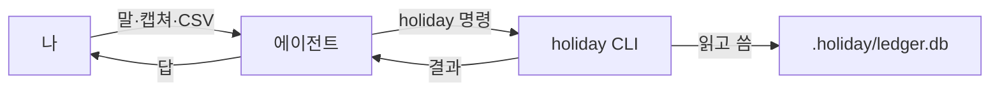
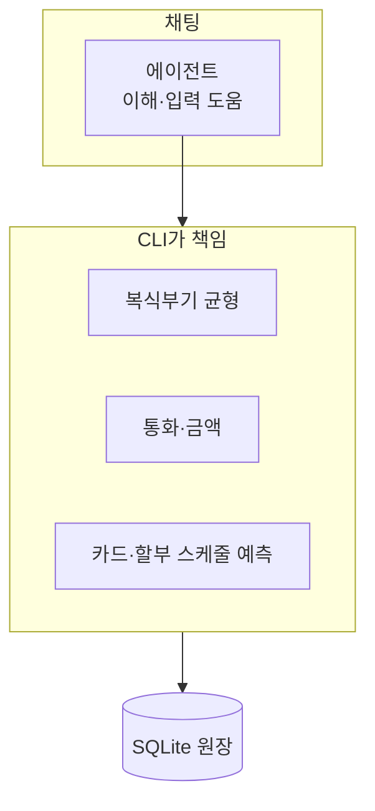
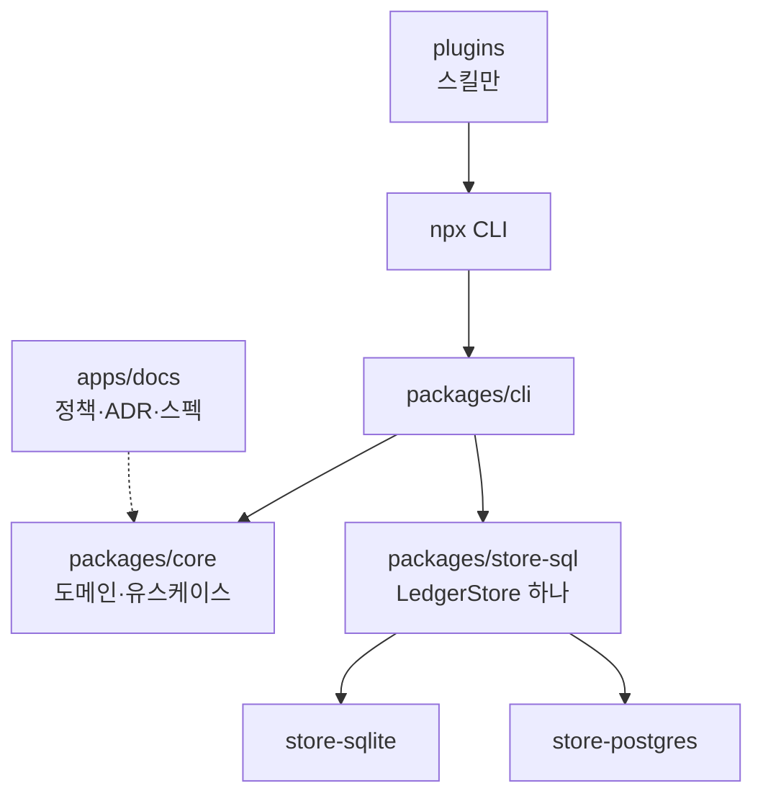

# holiday

1인용 복식부기 원장. 가계부·부채·자산·현금흐름을 에이전트와 함께 관리한다.

말로 하거나 캡쳐를 넘기면 에이전트가 `holiday` CLI를 호출하고, CLI가 장부 규칙·통화·스케줄을 지킨다. 수기 정리만으로는 장부가 맞는지 검증하기 어렵다. 그 검증을 CLI가 맡는다.

> **경고:** v0.1이다. 원장 포맷은 아직 약속이 아니다. 마이그레이션은 append-only지만 스키마는 굳지 않았다. 자기 돈으로 쓰기 전에 [아직 없는 것](#아직-없는-것)을 읽어라.

**바로 시작 → [설치](#설치).** Claude Code나 Codex 채팅에 두 줄 붙이면 끝이다. 그다음은 "가계부 시작하자"처럼 말만 하면 된다.

## 개요

`holiday`는 에이전트용 가계부 CLI다.

- **에이전트** — 말을 이해하고, 캡쳐·CSV를 읽고, 명령을 친다.
- **CLI** — 복식부기 균형, 통화, 카드·할부 스케줄을 책임진다.
- **원장** — 폴더 안 `.holiday/ledger.db`(SQLite)에 남는다.

잔액 숫자 하나보다 **어느 날 현금이 모자라는지**를 본다.

## 설치

이미 **Claude Code**나 **Codex**를 쓰고 있다면, 아래 두 줄을 그대로 붙이면 된다. ("마켓플레이스"는 플러그인을 받아오는 창구다. 개념은 몰라도 된다.)

**Claude Code** — 채팅에 붙여넣기:

```
/plugin marketplace add ssota-labs/holiday-cfo
/plugin install holiday-cfo@holiday-cfo
```

**Codex** — 터미널에서:

```bash
codex plugin marketplace add ssota-labs/holiday-cfo
codex plugin install holiday-cfo
```

원장을 다루는 CLI는 처음 쓸 때 `npx @holiday-cfo/cli`로 받는다. **Node 24+**만 있으면 된다 ([nodejs.org](https://nodejs.org)).

> **왜 프롬프트 한 줄로 자동 설치가 안 되나?** Claude Code는 보안상 채팅으로 플러그인을 설치하지 못하게 막는다. 붙여넣은 `/plugin ...`은 실행되지 않고 텍스트로 남는다. 위 두 줄은 사람이 직접 입력해야 한다.

**폴더에 박아두고 자동 설치.** 가계부 폴더의 `.claude/settings.json`에 아래를 넣으면, 그 폴더에서 Claude Code를 열 때 설치가 뜬다.

```json
{
  "extraKnownMarketplaces": {
    "holiday-cfo": {
      "source": { "source": "github", "repo": "ssota-labs/holiday-cfo" }
    }
  },
  "enabledPlugins": { "holiday-cfo": "holiday-cfo" }
}
```

## 사용 방법

설치 후 아래를 채팅에 붙이면 세팅이 끝난다. 에이전트가 `init`부터 계좌 등록까지 한다.

```
가계부를 시작하고 싶어. 이 폴더를 비공개(private) git 저장소로 두라고 알려주고,
holiday 원장을 만든 다음, 내 주요 통장과 신용카드를 하나씩 물어보면서 등록해줘.
카드는 마감일·결제일도 같이. 다 되면 지금 현금흐름을 보여줘.
```

이후엔 명령어를 외울 필요가 없다.

- **"어제 이마트에서 42,000원 썼어"** → 기록
- **"은행 앱 거래내역 캡쳐한 거 있는데 넣어줘"** → 이미지를 읽어 입력
- **"거래내역 CSV 파일 있어"** → 파일을 읽어 통째로 입력
- **"이번 달 카드값 내면 현금 괜찮아?"** → 할부·정기지출까지 계산
- **"3천만원짜리 전세 들어가면 6월에 현금 어때?"** → 원장은 건드리지 않고 시뮬레이션

원장은 만든 폴더의 `.holiday/`에 저장된다. **비공개(private) 저장소에 두어라** — 당신 돈이다.

<details>
<summary>플러그인 없이 CLI만 직접 쓰기</summary>

터미널에서 `npx @holiday-cfo/cli`로 쓸 수 있다. `holiday`는 그 CLI다.

```bash
holiday init --currency KRW
holiday account add Assets:Bank:KB:Checking --commodity KRW --cash
holiday account add Liabilities:Card:Shinhan --commodity KRW
holiday card add Liabilities:Card:Shinhan --funding Assets:Bank:KB:Checking \
  --close-day 14 --payment-day 1 --label "신한"

holiday txn add --date 2026-07-17 --payee "이마트" \
  --leg "Expenses:Food:Groceries 42000 KRW" \
  --leg "Liabilities:Card:Shinhan -42000 KRW"

holiday cashflow
```

</details>

## 어떻게 동작하는가

일상 사용은 이런 흐름이다.



역할은 나뉜다. 에이전트는 이해하고 입력을 돕고, CLI는 장부가 깨지지 않게 막는다.



플러그인은 스킬만 담는다. CLI 본문은 npm에 있고, 에이전트가 `npx @holiday-cfo/cli`로 받는다.

## 왜 만들었나

가계부 앱은 대개 단식부기 + 카테고리에서 멈춘다. 그러면 두 가지가 어렵다.

**신용카드.** 7/17에 긁은 커피는 그날 현금이 나가지 않는다. 8/14에 마감되고 9/1에 통장에서 빠진다. "잔액"은 이 간극을 모른다.

```
$ holiday cashflow --until 2026-10-31
cash on hand (2026-07-17):  3000000 KRW

2026-07-25   -      800000   →      2200000
             월세                            800000
2026-08-25   -     2267052   →      1000000
             월세                            800000
             KB 주담대 (1/360)              1467052
2026-10-01   -      117000   →       -17000   ⚠ SHORT
             냉장고 (2/12)                   100000
             넷플릭스 (2026-08-17 결제분)      17000

⚠ Short by 17000 KRW on 2026-10-01.
```

`⚠ SHORT`가 답이다. 잔액은 숫자 하나를 주고, 현금흐름은 **어느 날 터지는지**를 준다.

**다통화.** ₩1,000,000을 보내 $750.00을 받으면 내재환율이 1333.3333…으로 안 끝난다. 환율을 저장해 되곱하면 ₩999,998이 나오고, 허용오차를 두게 된다. 그 허용오차가 잡고 싶은 크기(누락된 ₩50 수수료)를 가린다.

`holiday`는 전기마다 두 정수를 둔다 — `units`(사실, 자기 통화)와 `weight`(측정, KRW). 불변식은 `SUM(weight) = 0`이고, **정확히** 0이다. 허용오차 파라미터는 없다.

## 저장소 구성



| 경로 | 역할 |
|---|---|
| `packages/core/` | 도메인·포트·유스케이스. 바깥 어댑터를 import하지 않는다 |
| `packages/store-sql/` | `LedgerStore` 구현 — 방언과 무관한 하나 |
| `packages/store-sqlite/` | SQLite 드라이버·스키마·PRAGMA |
| `packages/store-postgres/` | Postgres 드라이버·스키마 |
| `packages/store-testkit/` | 적합성 스위트 — 포트 계약의 실행 가능한 검사 |
| `packages/cli/` | composition root, dash 템플릿 (npm, bin: `holiday`) |
| `packages/ui/` | shadcn primitive |
| `packages/blocks/` | 대시보드 어휘 (도메인 블록 + json-render 카탈로그) |
| `apps/docs/` | 정책·ADR·CLI 스펙 (Fumadocs) |
| `plugins/claude-code/` | Claude Code 플러그인 (스킬만) |
| `plugins/codex/` | Codex 플러그인 (스킬만) |

문서: [apps/docs](https://github.com/ssota-labs/holiday-cfo/tree/main/apps/docs). 각 페이지에 `.md` 쌍둥이가 있다. 이 도구를 운전하는 쪽이 에이전트라서다.

## 설계 원칙

| | |
|---|---|
| **환율이 아니라 상대금액으로 균형** | 환율은 표시용. 되곱하지 않으니 허용오차가 필요 없다 |
| **금액은 i64 minor unit** | `number`는 2^53까지만 정확하다 |
| **스케줄은 원장 밖** | 카드·할부·정기지출·대출은 예측이다. 전기하면 금리 변경이 과거를 오염시킨다 |
| **SQLite가 system of record** | 감사는 `audit_log` 해시 체인. `git log`가 아니다 |
| **Notion/Airtable은 원장이 될 수 없다** | 원자성·유니크 제약이 없다. `init()`이 티어 계약을 못 지키면 throw한다 |

정책 규칙은 강제 테스트에 링크돼 있고, CI가 링크를 검사한다. 자세한 결정은 [ADR](https://github.com/ssota-labs/holiday-cfo/tree/main/apps/docs)에 있다.

## 아직 없는 것

없는 것을 적어 두는 편이 즉흥으로 메우는 것보다 낫다.

- **OCR이 없다.** 에이전트가 파서다. `ingest submit`은 에이전트가 읽은 것을 받고, 이미지는 해시 말고는 보지 않는다. 제출은 **드래프트**로 들어가, 사람이 `review accept`하기 전까지 잔액에서 빠진다.
- **자동 승인이 없다.** 모든 드래프트에 사람이 필요하다. 룰 엔진은 없다.
- **유이자 할부수수료를 계산하지 않는다.** 명세서에서 읽은 값은 받는다(`--fees`). 카드사 공식은 제각각이라, 그럴듯하게 틀린 숫자가 예측을 조용히 오염시킨다.
- **환율을 자동으로 가져오지 않는다.** `fx add`가 사용자가 준 값을 받는다. 없는 환율은 추측하지 않고 throw한다.
- **대시보드는 스냅샷이지 라이브가 아니다.** `dash data`가 마지막으로 구운 것을 렌더한다. Codex Sites는 원격 정적 호스팅이라 `ledger.db`를 열 수 없다 — 라이브가 필요하면 Supabase 어댑터에 물려야 한다.
- **18자리 ERC-20 토큰은 표현 불가.** i64라 ETH는 8자리로 절사한다. 개인 순자산엔 충분하고, 온체인 대사엔 틀리다.

## 기여

코드를 고칠 때는 [AGENTS.md](AGENTS.md)를 본다. 채팅에서 원장을 운전할 때는 플러그인 스킬(`plugins/claude-code/skills/holiday-cfo/` 또는 `plugins/codex/`)을 본다.

```bash
pnpm install
pnpm build
pnpm test
pnpm typecheck
pnpm lint
```

CLI 실행 (빌드 후):

```bash
node packages/cli/dist/main.js <command>
```

데모는 scratch 디렉터리에서. `holiday init`이 `.holiday/ledger.db`를 만든다. 사용자 원장을 테스트 fixture로 커밋하지 마라.

## 라이선스

MIT
